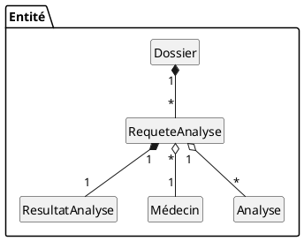

# Abstractions

## Diagramme de classe

## Glossaire

### Entités

#### Requête d'analyse sanguine

* Définition : Une requête d'analyse sanguine est une demande provenant d'un médecin qui requiert l'évaluation de certaines propriétés d'un échantillon sanguin. Voir InfoClient/Requête *.pdf pour des exemples de requête d'analyse de divers hopitaux.
* Synonyme : N/A

#### Résultat d'analyse

* Définition : Lié à une requête d'analyse sanguine, un résultat d'analyse représente les valeurs associés aux propriétés évalués lors de l'analyse de l'échantillon.
* Synonyme : N/A

#### Analyse

* Défintion : Une analyse représente un type de résultat suite à une analyse sanguine. Dans une requête d'analyse, les analyses représentent les cases cochées. Par exemple: FSC -> Formule sanguine complète.
* Synonyme : N/A

#### Dossier

* Définition : Le dossier représente les informations d'un patient d'une analyse sanguine. Ce dossier est lié aux requêtes d'analyse présentes et passées.
* Synonyme : Dossier d'un patient

#### Médecin

* Définition : Le médecin est l'individu qui émet une requête d'analyse et qui recevra les résultats par la suite.
* Synonyme : Utilisateur (User)