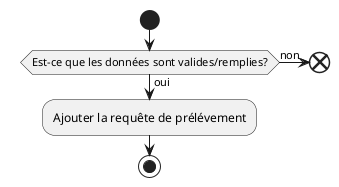

# UC01 - Création d'une requête de prélévement

## Acteur(s) primaires et secondaires

* user

## Préconditions/déclencheur

* Aucun

## Postconditions

* La requête doit être ajoutée à la base de donnée.

## Scénario de base

## Exceptions

* Si toutes les données ne sont pas remplies, la requête doit être annulée.
* Si les données ne sont pas valides, la requête doit être annulée.

## Besoin non-fonctionnels spécifiques

* Aucun

## Importance du cas d'utilisations

* Très élevée
