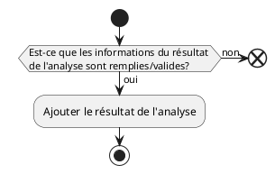

# UC07 - Ajout du résultat de l'analyse au dossier d'un patient

## Acteur(s) primaires et secondaires

* user

## Préconditions/déclencheur

* Avoir sélectionné un dossier de patient.

## Postconditions

* Le résultat de l'analyse de la requête de prélévement est ajouté à la base de donnée

## Scénario de base

## Exceptions

* Si les informations du résultat de l'analyse ne sont pas remplies, le résultat doit être annulé.
* Si les informations du résultat de l'analyse ne sont pas validess, le résultat doit être annulé.

## Besoins non-fonctionnels spécifiques

* Aucun

## Importance du cas d'utilisations

* Priorité
