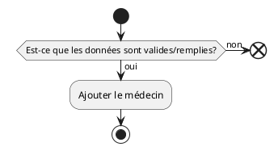

# UC09 - Créer un médecin

## Acteur(S) primaires et secondaires

* user

## Préconditions/déclencheur

* Aucun

## Postconditions

* Le nouveau médecin doit être ajoutée à la base de donnée.

## Scénario de base

## Exceptions

* Si toutes les données ne sont pas remplies, la requête doit être annulée.
* Si les données ne sont pas valides, la requête doit être annulée.

## Besoins non-fonctionnels spécifiques

* Aucun
