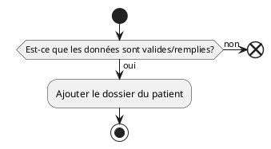

# UC10 - Créer le dossier d'un patient

## Acteur(s) primaires et secondaires

* user

## Préconditions/déclencheur

* Aucun

## Postconditions

* Le dossier du patient doit être ajouté à la base de donnée.

## Scénario de base

## Exceptions

* Si toutes les données ne sont pas remplies, la création du dossier de patient doit être annulée.
* Si les données ne sont pas valides, la création du dossier du patient doit être annulée.

## Besoins non fonctionnels

* Aucun
