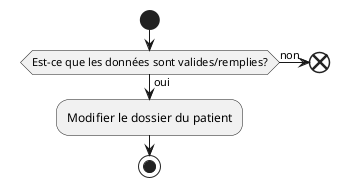

# UC11 - Modifier le dossier d'un patient

## Acteur(s) primaires et secondaires

* user

## Préconditions/déclencheur

* Avoir sélectionné le dossier d'un patient

## Postconditions

* Le dossier du patient doit être modifié dans la base de donnée.

## Scénario de base

## Exceptions

* Si toutes les données ne sont pas remplies, la modification du dossier de patient doit être annulée.
* Si les données ne sont pas valides, la modification du dossier du patient doit être annulée.

## Besoin non-fonctionnels

* Aucun

## Importance du cas d'utilisations

* Secondaire
