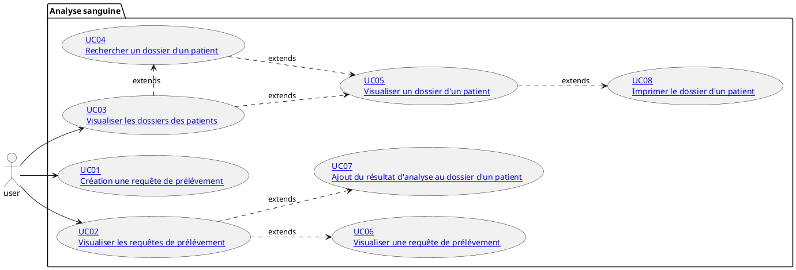

# Cas d'utilisations

```plantuml
@startuml
left to right direction
actor user as user

package "Analyse sanguine"{
    usecase ([[#!UseCases/UC01.md UC01\nCréation une requête de prélévement]]) as UC01

    usecase ([[#!UseCases/UC02.md UC02\nVisualiser les requêtes de prélévement]]) as UC02

    usecase ([[#!UseCases/UC03.md UC03\nVisualiser les dossiers des patients]]) as UC03

    usecase ([[#!UseCases/UC04.md UC04\nRechercher un dossier d'un patient]]) as UC04

    usecase ([[#!UseCases/UC05.md UC05\nVisualiser un dossier d'un patient]]) as UC05

    usecase ([[#!UseCases/UC06.md UC06\nVisualiser une requête de prélévement]]) as UC06

    usecase ([[#!UseCases/UC07.md UC07\nAjout du résultat d'analyse au dossier d'un patient]]) as UC07

    usecase ([[#!UseCases/UC08.md UC08\nImprimer le dossier d'un patient]]) as UC08

    UC02 ..> UC06 : extends
    UC03 .> UC04 : extends
    UC03 ..> UC05 : extends
    UC04 ..> UC05 : extends
    UC05 ..> UC08 : extends
    UC02 ..> UC07 : extends
}

user --> UC01
user --> UC02
user --> UC03
```
