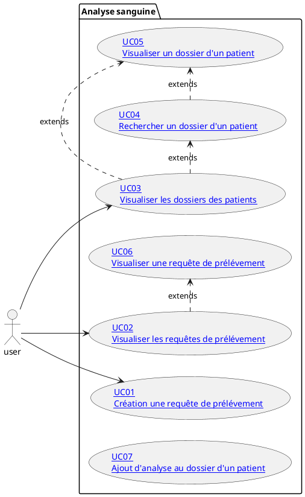

# Cas d'utilisations

```plantuml
@startuml
left to right direction
actor user as user

package "Analyse sanguine"{
    usecase ([[#!UseCases/UC01.md UC01\nCréation une requête de prélévement]]) as UC01

    usecase ([[#!UseCases/UC02.md UC02\nVisualiser les requêtes de prélévement]]) as UC02

    usecase ([[#!UseCases/UC03.md UC03\nVisualiser les dossiers des patients]]) as UC03

    usecase ([[#!UseCases/UC04.md UC04\nRechercher un dossier d'un patient]]) as UC04

    usecase ([[#!UseCases/UC05.md UC05\nVisualiser un dossier d'un patient]]) as UC05

    usecase ([[#!UseCases/UC06.md UC06\nVisualiser une requête de prélévement]]) as UC06

    usecase ([[#!UseCases/UC07.md UC07\nAjout d'analyse au dossier d'un patient]]) as UC07
}

user --> UC01
user --> UC02
user --> UC03

UC03 .> UC04 : extends
UC03 .> UC05 : extends
UC04 .> UC05 : extends

UC02 .> UC06 : extends
```
