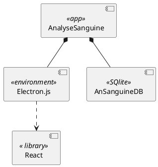
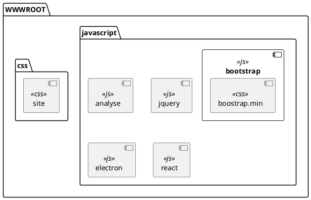

# Diagramme de composantes

```plantuml
@startuml
top to bottom direction

    component "AnalyseSanguine" << app >> as AS
    component "React" << library >> as RE
    component "Electron.js" << environment >> as DL
    component "AnSanguineDB" << SQlite >> as ASDB

    DL ..> RE
    AS *-- DL
    AS *-- ASDB

@enduml
```

```plantuml
@startuml
package WWWROOT{
    package javascript {
        component analyse <<js>>
        component jquery <<js>>
        component bootstrap <<js>>
        component electron <<js>>
        component react <<js>>
    }

    package css{
        component site <<css>>
        component bootstrap{
            component "boostrap.min" <<css>>
        }
    }
}
@enduml
```
