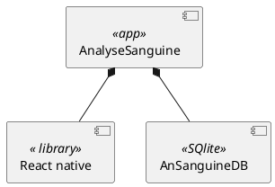
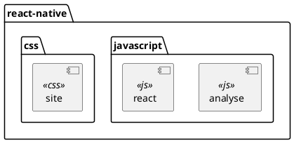

# Diagramme de composantes

```plantuml
@startuml
top to bottom direction

    component "AnalyseSanguine" << app >> as AS
    component "React native" << library >> as RE
    component "AnSanguineDB" << SQlite >> as ASDB

    AS *-- RE
    AS *-- ASDB

@enduml
```

```plantuml
@startuml
package react-native{
    package javascript {
        component analyse <<js>>
        component react <<js>>
    }

    package css{
        component site <<css>>
    }
}
@enduml
```
