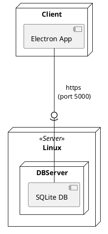

# Diagramme de déploiement

```plantuml
@startuml
top to bottom direction

node Client {
    [Electron App]
}

node Linux << Server >> {
    node DBServer{
        [SQLite DB]
    }
}

[Electron App] -0)-- [SQLite DB] : https \n(port 5000)

@enduml
```
