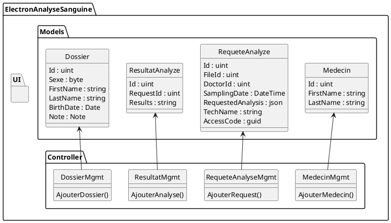

# Modèle de conception

```plantuml
@startuml
hide circle
package ElectronAnalyseSanguine {
    package UI {
        
    }

    package Controller {
        class MedecinMgmt {
            AjouterMedecin()
        }

        class RequeteAnalyseMgmt {
            AjouterRequest()
        }

        class ResultatMgmt {
            AjouterAnalyse()
        }

        class DossierMgmt {
            AjouterDossier()
        }
    }

    package Models {
        class Medecin {
            Id : uint
            FirstName : string
            LastName : string
        }

        class ResultatAnalyze {
            Id : uint
            RequestId : uint
            Results : string
        }

        class RequeteAnalyze {
            Id : uint
            FileId : uint
            DoctorId : uint
            SamplingDate : DateTime
            RequestedAnalysis : json
            TechName : string
            AccessCode : guid
        }

        class Dossier {
            Id : uint
            Sexe : byte
            FirstName : string
            LastName : string
            BirthDate : Date
            Note : Note
        }
    }
}

Medecin <-- MedecinMgmt
ResultatAnalyze <-- ResultatMgmt
RequeteAnalyze <-- RequeteAnalyseMgmt
Dossier <-- DossierMgmt
@enduml
```
