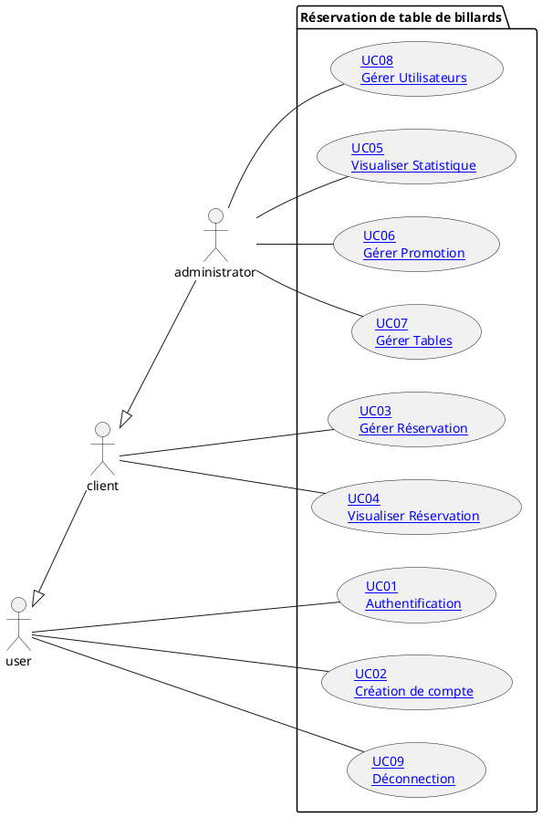

# Cas d'utilisations

```plantuml
@startuml
left to right direction
actor administrator as administrator
actor client as client
actor user as user

user <|-- client
client <|-- administrator

package "Réservation de table de billards"{
    usecase ([[#!UseCases/UC01.md UC01\nAuthentification]]) as UC01

    usecase ([[#!UseCases/UC02.md UC02\nCréation de compte]]) as UC02

    usecase ([[#!UseCases/UC03.md UC03\nGérer Réservation]]) as UC03

    usecase ([[#!UseCases/UC04.md UC04\nVisualiser Réservation]]) as UC04

    usecase ([[#!UseCases/UC05.md UC05\nVisualiser Statistique]]) as UC05

    usecase ([[#!UseCases/UC06.md UC06\nGérer Promotion]]) as UC06

    usecase ([[#!UseCases/UC07.md UC07\nGérer Tables]]) as UC07

    usecase ([[#!UseCases/UC08.md UC08\nGérer Utilisateurs]]) as UC08

    usecase ([[#!UseCases/UC09.md UC09\nDéconnection]]) as UC09
}

user -- UC01
user -- UC02
user -- UC09

client -- UC03
client -- UC04

administrator -- UC05
administrator -- UC06
administrator -- UC07
administrator -- UC08
```
