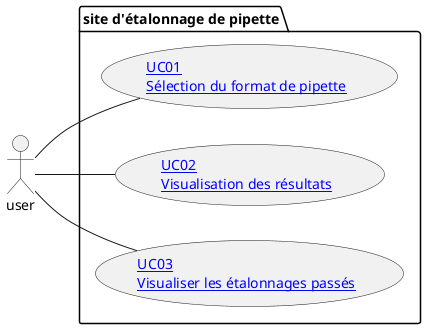

# Cas d'utilisations

```plantuml
@startuml
left to right direction
actor user as user

package "site d'étalonnage de pipette" {
    usecase ([[#!UseCases/UC01.md UC01\nSélection du format de pipette]]) as UC01

    usecase ([[#!UseCases/UC02.md UC02\nVisualisation des résultats]]) as UC02

    usecase ([[#!UseCases/OC03.md UC03\nVisualiser les étalonnages passés]]) as UC03
}

user -- UC01
user -- UC02
user -- UC03
```
